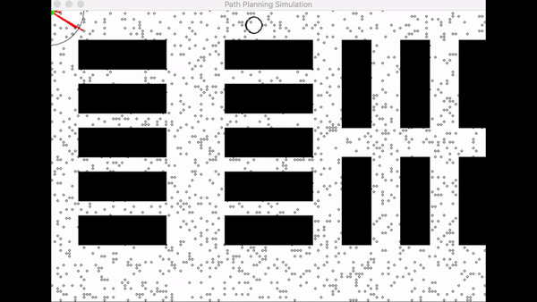
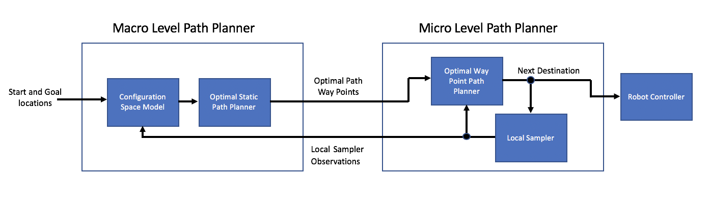

# MTHE493 Project: Motion Planning in Stochastic Environments

## This group consist of:
Andrew Downie, 
Lachlan Devir, 
Alex Taylor, and
Chris Caromicoli
## Description
This is the Capstone Project for MTHE493. The project is an experimental Motion Planner for Stochastic Enviroments. The planner utilizes a Fast Marching Trees Algorithm with a cost-function dictated by a markov model of the enviroment to reroute a robot around unforseen obstacles and avoid them in the future.

The robot in the upper left is naviagting towards the black circles and during the traversal it can encounter unforseen obstacles and must reroute around them. After this the Robot's planner updates its model of the enviroment and will later optimize later paths to avoid areas with areas with a high probability of encountering unforseen obstacles.

The following flow diagram outlines the planners two-stage system that is used to navigate in stochasitc environments.

